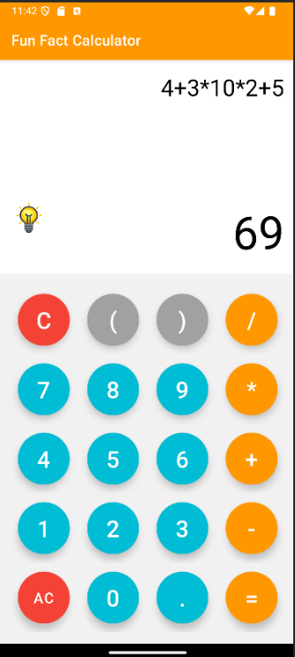
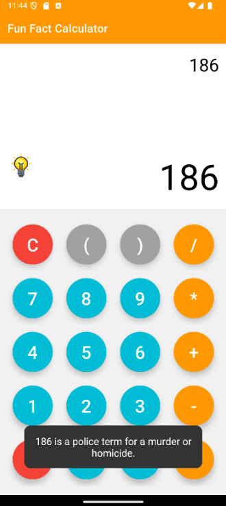
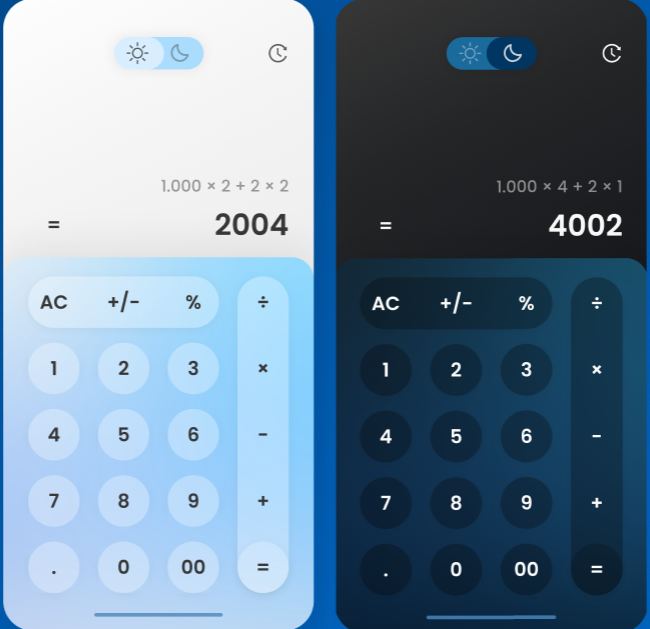

# Rapport de Projet - Fun Fact Calculator

## 1. Introduction
Le projet **Fun Fact Calculator** consiste à développer une calculatrice mobile capable de fournir des faits amusants liés aux résultats des calculs. L’objectif principal est de combiner l’utilité d’une calculatrice classique avec un aspect ludique pour rendre l’expérience utilisateur plus engageante.

Ce projet a été réalisé dans le cadre de l’apprentissage des architectures modernes, telles que **MVVM**, et de l’intégration des API externes, comme **Numbers API**. L’application a été développée avec **Android Studio**, en utilisant **Java** et des bibliothèques comme **Volley** et **Rhino**.

Les points clés du projet incluent :
- L’évaluation des expressions mathématiques à l’aide du moteur **Rhino**.
- L’utilisation d’une API pour récupérer des faits amusants.
- Un design intuitif basé sur les principes UX.

---

## 2. Rapport
### 2.1. Principes UX
L’interface utilisateur a été conçue en appliquant les concepts du [Daily UX Crash Course: 16 of 31](https://www.joelmarsh.com/articles/daily-ux-crash-course-16-of-31) de Joel Marsh. Les principes suivants ont guidé les choix de design :
- **Regroupement des boutons similaires** : Les boutons ont été disposés de manière logique (chiffres, opérateurs, fonctions spéciales) pour une meilleure lisibilité et accessibilité.
- **Couleurs fonctionnelles** : Les boutons essentiels (par exemple, `AC` et `=`) utilisent des couleurs distinctes pour indiquer leur importance et guider l'utilisateur visuellement.

Ces choix garantissent une utilisation intuitive et une navigation fluide.

### 2.2. Présentation de l’innovation
L’innovation principale réside dans l’intégration de faits amusants liés aux résultats numériques. Ce concept, en plus d’être unique, encourage l’utilisateur à passer plus de temps sur l’application, rendant celle-ci plus attractive et potentiellement rentable.

- **Indicateur visuel** : Une ampoule s’allume pour signaler qu’un fait amusant est disponible.
- **Expérience utilisateur enrichie** : En combinant calculs et faits amusants, l’application offre une expérience divertissante, augmentant ainsi son attrait.

### 2.3. Critique du travail
#### Points faibles :
- **Hésitation technologique** : J’ai hésité à utiliser des outils modernes comme **Jetpack Compose** et **Kotlin**, qui auraient pu simplifier certaines parties du projet et offrir plus de flexibilité.
- **Design initial** : Bien que j’aie utilisé Figma pour concevoir l’interface, je n’ai pas pu transférer directement mes designs en XML à cause de limitations techniques, ce qui a ralenti la phase de développement.
- **Manque de tests automatisés** : Bien que l’application ait été testée manuellement et fonctionne correctement, l’absence de tests unitaires ou d’intégration est une lacune à combler pour garantir une qualité encore meilleure.

#### Perspective d'amélioration :
- Explorer **Jetpack Compose** et **Kotlin** dans les futurs projets pour bénéficier de leurs avantages en termes de productivité et de modernité.
- Développer une meilleure intégration entre Figma et Android Studio pour rendre la conception et le développement plus fluides.
- Mettre en place des tests automatisés pour améliorer la robustesse et faciliter les futures évolutions de l’application.

### 2.4. Rapport GitLab Pages
Le rapport est hébergé via **GitHub Pages**, avec le lien suivant : [Rapport GitHub Pages](https://tahabrida.github.io/fun-fact-calculator).

Des **difficultés rencontrées** lors de la configuration de GitLab Pages ont marqué ce projet :
- Problème de configuration du runner CI/CD pour les pipelines GitLab.
- Proxy réseau imposé par l’environnement, causant des erreurs de déploiement.
- Solution alternative : hébergement des fichiers sur GitHub Pages pour garantir une présentation accessible.

Cependant, l’historique complet du projet reste disponible sur GitLab : [Dépôt GitLab](https://gitlab.ecole.ensicaen.fr/brida/tp-calculatrice).

---

## 3. Application

### 3.1. Fonctionnalité et stabilité
L’application a été développée pour garantir une utilisation fluide et sans crash dans les scénarios d’utilisation courants. Toutes les fonctionnalités principales ont été testées avec succès :
- L’évaluation des expressions mathématiques,
- La gestion des erreurs utilisateur (par exemple, divisions par zéro ou expressions incorrectes),
- Les appels à l’API Numbers pour récupérer les faits amusants.

L’installation sur un appareil physique a été réalisée avec succès, confirmant la stabilité de l’application sur des téléphones réels en plus des émulateurs.

### 3.2. Gestion verticale/horizontale et MVVM
Une attention particulière a été portée à la gestion de la rotation de l’écran (mode portrait et paysage). Pour cela :
- L’architecture **MVVM** a été implémentée, permettant de conserver le contexte (par exemple, l’expression et le résultat affichés) après une rotation.
- L’interface reste fonctionnelle et les données utilisateur sont sauvegardées, offrant une expérience transparente même après un changement d’orientation.

### 3.3. Usage des Layouts
Pour concevoir l’interface, des **RelativeLayouts** ont été utilisés à la place des **ConstraintLayouts**. Ce choix a été motivé par la simplicité et la rapidité de mise en œuvre, même si cela a limité certaines optimisations liées à la responsivité.

Les éléments principaux (comme les boutons, les zones d’affichage et l’indicateur visuel) ont été positionnés de manière logique pour maximiser l’ergonomie tout en respectant le design souhaité.

---

## 4. Calculatrice

### 4.1. Javascript Engine ou équivalent
Pour l’évaluation des expressions mathématiques, le moteur **Rhino** a été utilisé. Rhino est un moteur JavaScript conçu pour s’intégrer aux applications Java, ce qui en fait un choix idéal pour ce projet.

**Raisons du choix de Rhino :**
- Capable d’évaluer des expressions mathématiques complexes via du code JavaScript.
- Facilité d’intégration avec Android grâce à sa compatibilité avec Java.
- Bonne performance et précision, nécessaires pour une calculatrice.

**Exemple d’utilisation dans le projet :**
- Les expressions saisies par l’utilisateur sont évaluées dynamiquement par Rhino, ce qui permet un traitement rapide et efficace des opérations comme `2 + 3 * (4 - 1)`.

---
## 5. RSS

### 5.1. Volley
Dans ce projet, la bibliothèque **Volley** a été utilisée pour effectuer des requêtes HTTP et intégrer l'API **Numbers**. Cette bibliothèque offre plusieurs avantages, notamment :
- **Facilité d'intégration** : Une API simple pour envoyer des requêtes et traiter les réponses JSON.
- **Gestion automatique des requêtes réseau** : Volley simplifie la gestion des connexions réseau en arrière-plan.
- **Performance optimisée** : Idéal pour les applications Android avec des besoins réseau fréquents.

#### Utilisation dans le projet :
- Les requêtes HTTP sont envoyées à l’API Numbers pour récupérer des faits amusants au format JSON.
- Les réponses JSON sont ensuite analysées et affichées sous forme de toast pour enrichir l'expérience utilisateur.

---

## 6. Bonifications

### 6.1. Configuration CI/CD
Bien que des difficultés aient été rencontrées avec les pipelines GitLab, une solution alternative a été mise en œuvre avec **GitHub Pages** pour l’hébergement du rapport.

### 6.2. Recherches personnelles
Des recherches approfondies ont été menées pour :
- Comprendre l’architecture **MVVM** et l’adapter au projet.
- Intégrer des bibliothèques comme **Volley** et **Rhino**.
-  **Figma pour le design UI** : J’ai investi beaucoup de temps dans l’utilisation de **Figma** pour concevoir une interface utilisateur moderne et intuitive. Cependant, je n’ai pas réussi à transférer les designs Figma en XML via les plugins en ligne que je comptais utiliser. Malgré cela, j’ai apprécié travailler avec Figma, ce qui m’a permis d’acquérir des compétences en design UI

### 6.3. Qualité du rapport
Le rapport est structuré de manière claire et suit les recommandations de la grille d’évaluation, avec une attention particulière portée à la présentation et à l’explication des choix techniques.

### 6.4. MVVM
Le passage à l’architecture **MVVM** a permis :
- Une séparation claire entre la logique métier et l’interface utilisateur.
- Une meilleure gestion du cycle de vie (par exemple, la sauvegarde des données lors de la rotation de l’écran).
- Une extensibilité accrue pour ajouter des fonctionnalités futures.

---

## 7. Conclusion
Le projet **Fun Fact Calculator** a été une excellente opportunité pour appliquer et approfondir mes compétences en développement mobile avec Android. Ce projet m’a permis de :
- Découvrir et utiliser des technologies modernes comme **MVVM**, **Volley**, et **Rhino**.
- Travailler sur l’intégration d’une API externe pour enrichir l’expérience utilisateur.

### Points positifs :
- Une application fonctionnelle avec une interface intuitive et des fonctionnalités uniques.
- Une bonne maîtrise des concepts fondamentaux du développement mobile.

### Limites et perspectives :
- L’intégration des designs Figma dans Android Studio reste un défi non résolu.
- Le support multilingue et le déploiement sur le Play Store sont des améliorations possibles pour l’avenir.

---

